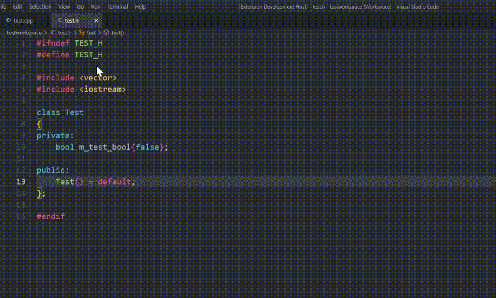
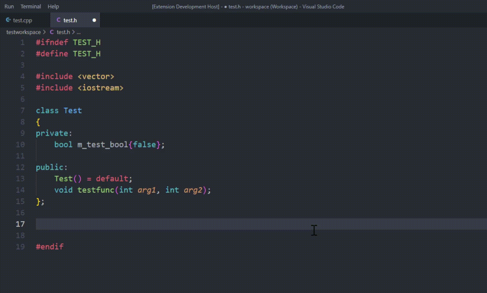
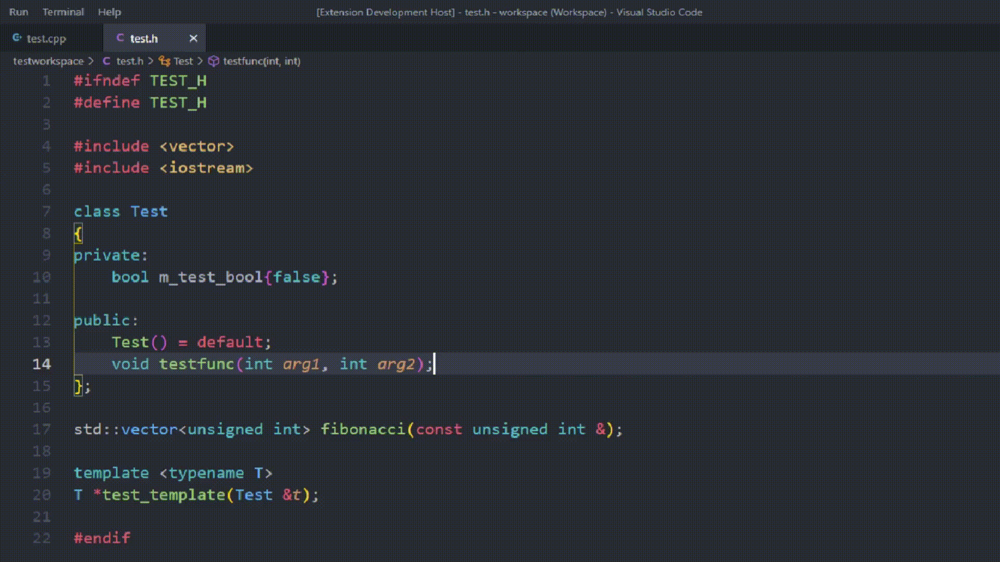
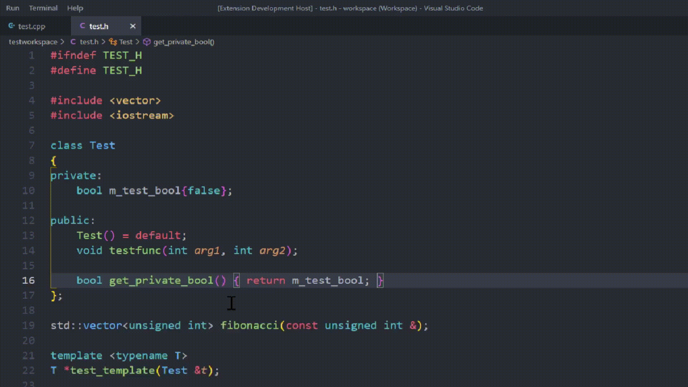
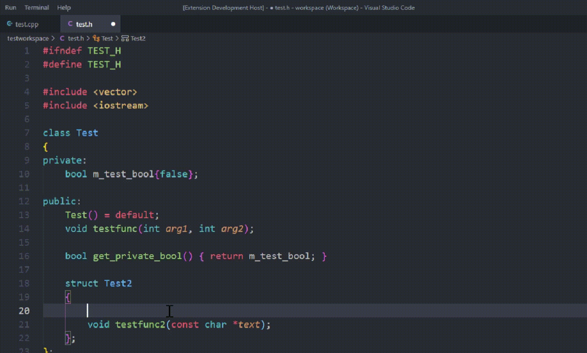

# C/C++ Definition Autocompletion

**Autocomplete function definitions from already declared function signatures.**

 

## Features
-----------

To trigger the autocompletion, type a `.` on a new blank line in your `.c/.cpp` file.

 

- ### **Support for member class functions:**

 

- ### **As well as for normal functions:**

 

- ### **Support for template functions:**

 

- ### **Detecting in header defined functions and don't suggesting them:**

 

- ### **Supporting nested member class functions:**

 

- ### **Special autocompletion handling for constructors:**

 

- ### **Only function declarations with no function definition are suggested.**

 

## Requirements
---------------

- C/C++ Extension

 

## Extension Settings
---------------------

This extension contributes the following settings:

* `definition-autocompletion.trigger_character`: The character that triggers the completion suggestion on a new blank line.
* `definition-autocompletion.update_index_on_save`: Wether to update the symbol index table when saving the current text document.
* `definition-autocompletion.update_index_on_change`: Wether to update the symbol index table when changing the active text editor

 

## Known Issues
---------------

- When trigger the suggestion on a file not parsed yet, the function definition right after the triggerCharacter is not parsed correctly.
- nested return Types are not extended by the outer layer Type

 

## Future Plans
---------------

- fix issues

 

## Release Notes
----------------

### 1.1.1

- supporting constructors member initialization list

### 1.1.0

 - supporting templates
 - supporting inline functions
 - supporting nested class members

### 1.0.0

 - Initial release

